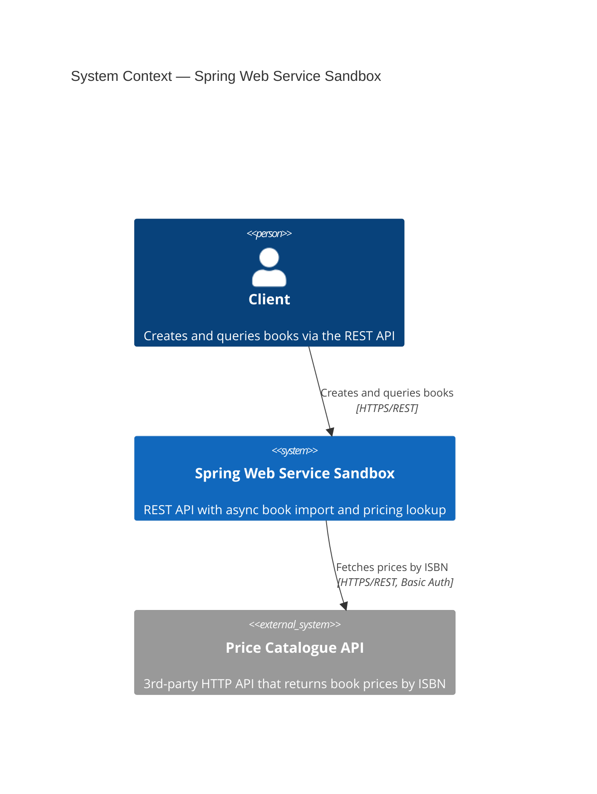
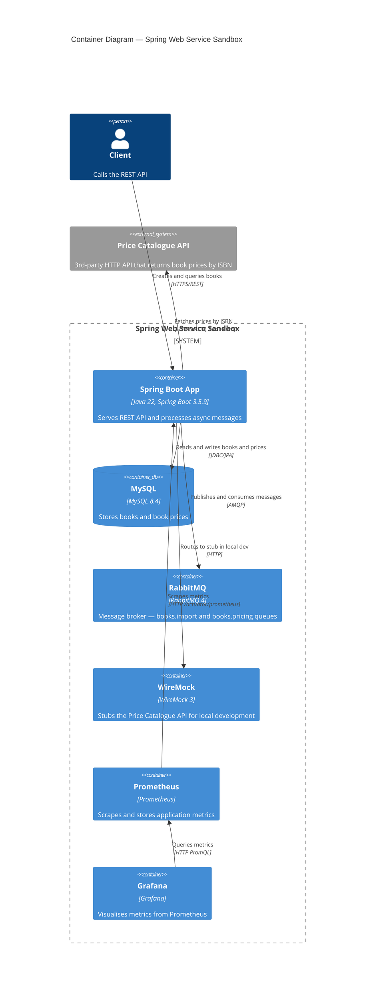
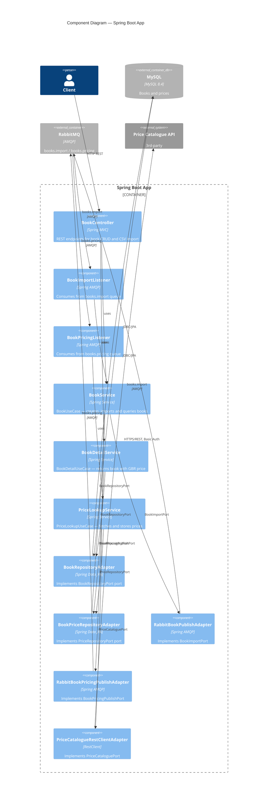
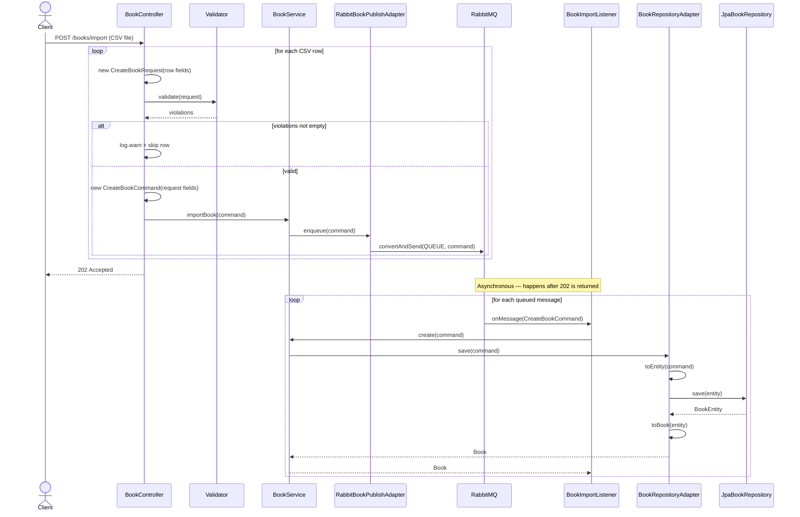
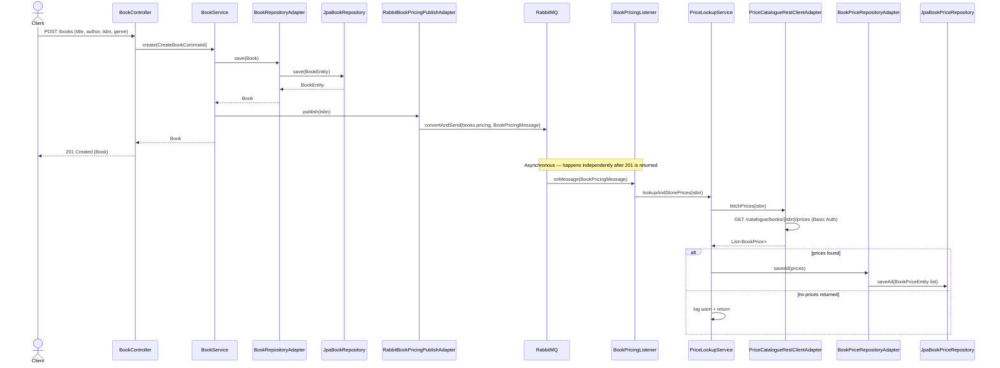

# Spring Web Service Sandbox

A sandbox for experimenting with Spring Boot Web service features. Built with Java 22 and Spring Boot 3.5.9.

Features:

* JSON REST API
* Async CSV bulk import via RabbitMQ - intra-service queue-based load leveling pattern
* Async book price lookup — on ingestion, ISBNs are queued and prices fetched from a 3rd-party catalogue API
* Spring Data JPA persistence to a MySQL DB
* Spring actuator for health, metrics, and operational endpoints
* Flyway DB migration
* OpenAPI docs with Swagger UI
* SLF4J/Logback debug logging
* Docker cluster for MySQL and RabbitMQ
* Multi-layer testing: Mockito, Spring and Testcontainers (Dockerised dependencies in tests)
* WireMock (via Testcontainers) for stubbing the 3rd-party price catalogue API in tests
* Prometheus metrics with Grafana dashboards

## C4 Architecture Diagrams

### Level 1 — System Context



[Edit diagram on mermaid.live](https://mermaid.live/edit#pako:eJx9ks9Kw0AQxl9l2FOFiAc95daWij0ooSkIEpBtMm0Wk924O1sbSsGH8Al9EvdPG2xBc5qd3fl-30xmz0pVIUvZ9G6qJOGOCgnuI0ENQt4bwhaON_D9-QV5p4XcwDOuIEe9FaV7xWW1UrtYmKE2So7KRqCkBAo2DVHBQqyRExpwBfBuUQsXr5R6M7AVHKhGWMzyJYyzecGuol60MDKR4UX-cRAgJwn4EFQDN70sAwRE2ylNAe4kSi_SuLztLmCvsx2NSk68URuLXjLTnjI9paJBf3Grq-uOa-rhYbnMApVqTqCRrJaxuQDzjfYwzydPA2yBzTCmX-39OaNI9Jz8xvd4JjQInPm-RyprV3_p4FwogQk3ooSxpdqJsoS1qFsuKpbumfsprd-PCtfcNsQOCeOWVO6mylLSjsO0spuapWveGHeyXeX8zypBSg9JDMfHuGph4xLWcfmiVHt8c_gBVYvZvw)

---

### Level 2 — Container



[Edit diagram on mermaid.live](https://mermaid.live/edit#pako:eJx9Vdtq20AQ_ZVhnxxwbUhSaP1mO2mbUBfZCg0UQxlJa3vJalfZSxIRDP2IfmG_pHuRFCtuqqeZleacmbNnV88klwUlEzI_n0thkAmq1gLcY5jhFLpFuGC4VVjCn1-_Ia0UE1u4pRmkVD2wnEKKosjkU6xNqNJSDHLOqDBDWJN5iNYkxMi5BrOjsLpMb2CaXK3JSaxLa21o-XMmrShQ1QMdQX3VfyjJCTzHev90HQ-wqg4qZ1IamFZVbOIaHxBOT4dw-PZs9H70Mb73HFR3HYKjgkrJnGrtllHXIofSJbilumu_R3-RDcpa33OPtqjT5dcIHEL4MDpveIxUDjCT8k4HEh85JjffG7gDhVnGTHnvy1chXiwjWJtBA76IDUKm5J3bQb9zgWjEykoq0_HpkSf0Mtxbat8kfmSKljK_89C3Ll64OBK1GZy1U9ksbnHiJ4E5GuRya2nQciMVcJkjh4I-UC6rMnjjn5xO85I6IKs9btJlked1nuYKKxqF1FFZZwLOcjRMCrdhxrXz1njO3RsU6HE-xzCC9pLvTFvkzJugQYONawIOO2nQ9z1PXz6ZQd7KEHs_UiZSnKniXYXK1PDl5iYJipkdGlDUWCX0oUMgq-EqnX3rOFeUd6eusf9cUTSNJm57FWvtFtk8Rzr2Pu-BhOLOvyuKRUR4VMz0_NpaNRyqi9l8fJ1Mj5EOPZvYzAm4a1rKpdC2DHK2p8l_NF0sk2OYnoCfqMk9ymsp-lMNYYaa5TC1ZncMeGjplbR-NCOddWwGTLyY9AW0B3FozvayaRzYWa0thDHmxqIz5bg69opH6_zX9_yy2bNjRO85f62ckCEpqSqRFWTyTFxl6W_0gm7QckP2Q4LWyNRdWWRilBOPKGm3OzLZINcus1XhHHJZMNdct0hDuog_h_CPGJIKxQ8py-ab_V-fXgzo)

---

### Level 3 — Component



[Edit diagram on mermaid.live](https://mermaid.live/edit#pako:eJydVs1u2zAMfhVBpxTI1sN6GHJLnGJr0QBu3PYwBBgUm0mE2ZIryduMosAeYk-4J5l-HMc_ctI0l1gUye8jRVJ6wTFPAE9wcBXwLOcMmFoxpH-KqhRQLURzSraCZOjfn78oygVlWzTjXKFpnjuDEITkbBSnVKuP0QoH9muFL9x-wJkilIGYr79f_1ajrJTPqdFblNH93QrXn-jzxyu31AA_JCIsQRowBtn3ZT0Jsl5TlT0bk6X9Xtw7B9PFfei-1sbVR6qjEQpdIrc0XnUgtduolAoy6zMmiqR8W4AxDg06CvYiNA1vnNdPIvmQE6FKD7MZL1hCRDkieW50u0nDF-jF2Ti7KtEjQ814ETxNQezTcJA45Mrb4ilw6-V19ICAJTmnTEm04cLGiILl49xmMIiekAu_5trHvbEKd1SngR2w29IW_iHBmqAsMtDQgmeole7nAgo4ghq6Y-jCdsRn4FbnehI4AvFTn-wesFq2gFoyo_QoISASbB_EAogCOa4S60pVgwqq-VgqR8DnoAsl7VBoCY8TcapNOgJUIZhDRr-o2qEvs6VrnQEedu9Oqxd5g0jYkw4zaeg2qWxAxTtwCZGKC_3ZaeF-QpaQ82lCcnUoASOSVNuX1UaLyFw3JLoNp06oqzSFDEz128M0qOhEvVv2Htxa_g5wa3sS3c0s11kNcDe-LIVinVK580Efir8Ts3MXnkKtGssP6_beg942PcLCVkI9TRs0Qt9GNd9Aqv2F4kt4bdXCfXV_S0jre6k_Xr8-PITIzM_azOgfLhX_YGxOuOZlM-jCM-U6t5DXSZdvZ24VstFTQ_q9UeO16sb4FqReUP6J4rWt9wea3_bQsNVABw30wYB5vxVOVPLeTyelZ4XgsfUNosMgaXnwZfiNHdWLxOfrTDq9yOt33e18FlzaCekpGjjDxnvSzUffm3uxe9x9J8ebcSDPrceiGSfRpZknYzQjksZoWqiddoPHOAOREZrgyQtWOz2-9MM7gQ0pUoVfx5gUikcli_FECe0LC15sd3iyIanUqyJP9GPjOjE3Ui0Eu1y4N7x9yo9xTtg3zrNK5_U_1rgN0g)

---

## Architecture

This project uses the **Ports and Adapters** (Hexagonal) architecture pattern. The codebase is organised into two top-level packages:

### `domain`

The core of the application — no framework or infrastructure dependencies.

| Package | Contents |
|---------|----------|
| `domain.model` | Domain objects (e.g. `Book`, `BookPrice`, `BookDetail`) |
| `domain.ports.in` | Incoming port interfaces — use cases the domain exposes to the outside world (e.g. `BookUseCase`, `BookDetailUseCase`, `PriceLookupUseCase`) |
| `domain.ports.out` | Outgoing port interfaces — abstractions the domain requires of infrastructure (e.g. `BookRepositoryPort`, `BookImportPort`, `BookPricingPublishPort`, `PriceCataloguePort`, `PriceRepositoryPort`) |
| `domain.usecase` | Implementations of the incoming ports (e.g. `BookService`, `BookDetailService`, `PriceLookupService`) |

### `adapters`

Adapters connect the domain to the outside world. They implement or call the port interfaces.

| Package | Contents |
|---------|----------|
| `adapters.in.web` | HTTP driving adapters — Spring MVC controllers and request DTOs |
| `adapters.in.messaging` | AMQP driving adapters — RabbitMQ listeners |
| `adapters.out.persistence` | JPA driven adapters — Spring Data repositories and entities |
| `adapters.out.messaging` | AMQP driven adapters — RabbitMQ publishers |
| `adapters.out.http` | HTTP driven adapters — declarative `@HttpExchange` client for the 3rd-party price catalogue API |

### `config`

Spring `@Configuration` classes that wire adapters to ports (dependency injection glue). These sit outside both `domain` and `adapters` as they are cross-cutting infrastructure.

---

## Build and test

```bash
./mvnw clean package
```

## Dependencies via Docker

* MySQL
* RabbitMQ
* WireMock — stubs the 3rd-party price catalogue API for local development
* Prometheus
* Grafana

Start the stack:

```bash
docker compose up -d
```

Stop them when done:

```bash
docker compose down
```

### MySQL

To open a MySQL shell inside the running container:

```bash
docker compose exec mysql mysql -u sandbox -p sandbox sandbox
```

### RabbitMQ UI

The RabbitMQ management UI is available at `http://localhost:15672` (guest/guest).

### WireMock

WireMock stubs the price catalogue API so that the full pricing flow works locally without a real 3rd-party API. Stub mappings are loaded from `src/test/resources/wiremock/mappings/` — the same files used by Testcontainers in integration tests.

| URL | Description |
|-----|-------------|
| `http://localhost:8081/__admin/mappings` | View all loaded stub mappings |
| `http://localhost:8081/catalogue/books/{isbn}/prices` | Call a stub directly (requires Basic Auth: `catalogue-user` / `secret`) |


### Prometheus UI

| URL | Description |
|-----|-------------|
| `http://localhost:9090` | Prometheus UI |
| `http://localhost:9090/targets` | Scrape target status — sandbox job should show UP |
| `http://localhost:9090/query` | Query explorer |


 Useful queries:

| Query | Description |
|-------|-------------|
| `books_import_listener_seconds_count` | Total number of import messages processed |
| `books_import_listener_seconds_sum` | Total time spent processing import messages |
| `books_import_listener_seconds_max` | Slowest single import message |
| `rate(books_import_listener_seconds_count[1m])` | Import messages per second over the last minute |
| `books_pricing_listener_seconds_count` | Total number of pricing messages processed |
| `books_pricing_listener_seconds_sum` | Total time spent fetching and storing prices |
| `books_pricing_listener_seconds_max` | Slowest single pricing message |
| `rate(books_pricing_listener_seconds_count[1m])` | Pricing messages per second over the last minute |

### Grafana

Grafana is available at `http://localhost:3000`. Anonymous access is enabled — no login required.

Prometheus is pre-configured as the default datasource — no manual setup required.

### Connecting to MySQL

```sql
SHOW TABLES;

INSERT INTO books (title, author, isbn, genre) 
VALUES ('The Pragmatic Programmer', 'David Thomas & Andrew Hunt', '978-0135957059', 'Software Engineering');

SELECT * FROM books;
```

## Run local

```bash
./mvnw spring-boot:run -Dspring-boot.run.profiles=local
```

## Bulk import

The `POST /books/import` endpoint accepts a CSV file with a header row and data rows:

```
title,author,isbn,genre
Domain-Driven Design,Eric Evans,978-0321125217,Software Architecture
Clean Code,Robert C. Martin,978-0132350884,Software Engineering
```

Importing a CSV:

```bash
# 10 books
curl -X POST http://localhost:8080/books/import -F "file=@src/test/resources/books-10.csv"

# 10,000 books
curl -X POST http://localhost:8080/books/import -F "file=@src/test/resources/books-10k.csv"
```

## Endpoints

### API

| URL | Description |
|-----|-------------|
| `GET http://localhost:8080/books` | List all books |
| `GET http://localhost:8080/books/{id}` | Get a book by ID, including its GBR price if available |
| `POST http://localhost:8080/books` | Add a new book |
| `POST http://localhost:8080/books/import` | Bulk import books from a CSV file (async via RabbitMQ) |
| `http://localhost:8080/swagger-ui.html` | Swagger UI |
| `http://localhost:8080/v3/api-docs` | OpenAPI JSON spec |

### Actuator 

| URL | Description |
|-----|-------------|
| `http://localhost:8080/actuator/health` | Application health status |
| `http://localhost:8080/actuator/metrics` | Application metrics |
| `http://localhost:8080/actuator/info` | Application info |
| `http://localhost:8080/actuator/env` | Environment properties and config values |
| `http://localhost:8080/actuator/loggers` | View and change log levels at runtime |
| `http://localhost:8080/actuator/mappings` | All registered request mappings |
| `http://localhost:8080/actuator/scheduledtasks` | All scheduled tasks |
| `http://localhost:8080/actuator/httpexchanges` | Recent HTTP request/response history |
| `http://localhost:8080/actuator/beans` | All Spring beans in the application context |
| `http://localhost:8080/actuator/prometheus` | Prometheus metrics scrape endpoint |

## Book pricing

When a book is created (via `POST /books` or CSV import), its ISBN is automatically published to an internal RabbitMQ queue (`books.pricing`). A listener picks this up and calls a 3rd-party price catalogue API to retrieve prices for multiple countries. The prices are stored in the `book_prices` table.

```
POST /books → save to DB → publish ISBN to books.pricing queue
                                    ↓
                        BookPricingListener picks up ISBN
                                    ↓
                        GET /catalogue/books/{isbn}/prices  (3rd-party API)
                                    ↓
                        Store prices in book_prices table
```

The `GET /books/{id}` endpoint includes the GBR price in its response (null if no price has been stored yet):

```json
{
  "id": 1,
  "title": "Clean Code",
  "author": "Robert C. Martin",
  "isbn": "978-0132350884",
  "genre": "Software Engineering",
  "gbrPrice": 24.99
}
```

The price catalogue API requires HTTP Basic Auth. Configure credentials in `application.yaml` (or via environment variables):

```yaml
pricing:
  catalogue:
    base-url: https://your-catalogue-api
    username: your-username
    password: your-password
```

### MySQL

Price data is stored in a separate `book_prices` table with a composite primary key of `(isbn, country_code)`:

```sql
SELECT * FROM book_prices WHERE isbn = '978-0132350884';
```

## Sequence Diagram for the import books journey

The key thing the diagram makes visible is the async boundary — the client gets its 202 Accepted as soon as all valid 
rows are enqueued, before any of them have actually been persisted. The RabbitMQ → listener → DB flow happens entirely 
independently afterwards.



[Edit diagram on mermaid.live](https://mermaid.live/edit#pako:eNqVVd1u2jAUfpUjX1EtUAh_xReVGOvFpnVry9qLiRuTHMBqYme2Q8uqSnuIPeGeZI5DgEBgXaRI9sn3fef4_DgvJJAhEko0_khRBPiBs7li8USAe1hgpIJRxFGYwpYwZXjAEyYMvJfycSSFUTKKUFUhHljEQ2ZVjtHvNY6YRmDabceoljzAY-iPcSKVubFvRrhj0yk3mf0mnUZcL4YhS0x1IDn2-va08meuDQo8Gu3YnmQT6x0mUnNrWZ3w-ylhZexEFLA8r_XLy3IaKdx8HX-D86m16nPu4oLaaPwAMx7h2ZYfSZnAzBYIWbCADKDkU_Exe8q6FY4EPsFIITOYx2ibQJuaVbGuMAr12Um1TW0pLPMl1lSuUSJucPWKEJZcRsxwKfT2YK71IrPzDYQ0gHFiVruYN50xkvPGE1MC3oF-5Ml-jjCyzefC_2_lcvZGMo6ZCIsMVGXwqOp6CCjk1c5MtSDXqxRY49fs7VBQQGG9p3iSvcVbgWIuKARSLFGZoQjHaM9xe391f-VBlZD9XGzdstjsnc2q5y1OwW_6MAwCtFOyg_8iDYK0TjfT6R2OIoWhXolgoaSQqYY_v37DgiUJ2qZgMzt0TptrUGhSJXbly_Ph8hJCjFqzOe4ep3BeSufWvRTXOad2UOyD-Shz96sbOH5lbQ6r6q4aCpotjzMcpow38koYblb_5BxcTGtf6Ogl2gG0XvaZLXOvbwrQtXeFmy1hP3HZ5li2jlRtl2KblHhkrnhIqFEpeiRGFbNsS14y0ISYBcY4IdQuQ6YeJ2QiXi3HXuHfpYwLmpLpfEHojNlLwyNpkl1561_mxqqsN1QjmQpDaLvfbzoVQl_IM6H1VrPbaQwuWheD3qDda_u-R1bW3Gv1G62e73da3U6n2-91Xz3y0zn2G81-u-V32gO_e9Fp9vsewTArwnX-53Y_8Ne_PKeKTA)

## Sequence Diagram for the book pricing lookup journey

When a book is created via `POST /books`, it is immediately saved to the database and its ISBN is published to the `books.pricing` RabbitMQ queue. The controller returns 201 before any pricing work happens. A listener picks up the message asynchronously and calls the 3rd-party price catalogue API, storing all returned prices in the `book_prices` table.



[Edit diagram on mermaid.live](https://mermaid.live/edit#pako:eJyNVdtu1DAQ_ZWRn1KRtsBjhCotS4WEWli68IL64o1nE4vEDrZTtKoq8RF8IV_CxE52cy30ZTvjc86M5-I8slQLZAmz-KNGleI7yTPDy3sF9MdTpw2sC4nKBU_FjZOprLhy8Fbr72utnNFFgWb-_KvFNbcI3Hpzi-ZBpjiP3VKwI_IOK20leQ4rwSs3p_-h4kPkvOzGkKWyTb0rpM032rgmxh3f7aSbni9GC4Tbz88GuZHWoZqjNwC8IWRd9WrS8y6WxmPW3PFCZzV2-Q-9i1l72KCw3vP_1R3B71VAhpk4v7oaDkECm0_bL3C5I6-FyElXYAy8drk2MUi7UzFkqAyeBZkhu5Vr65NAapA7jNb-J0DLkivRI7fYlukvmoDlDxg1dg_ojwg2GZoe_FpRwoeWNAGeD4OcCOMg42s0xlLG0-FMoApG1JSrd4MplDS6qaRiafWAxq2U2KISke_ARRU4cV_gFq3lGc4Ucaadw9x7rSJsmIEEXr98BaFHArqyB85H7RA0pXXcnnhmWRJY2YNKc6OVri38-fUbcl5VqCxIJZD-ERSnOADf06T6cNKCQVcbhaKL1UUYFvYUQ6v24tGztRjxSG26uQkU3mxq3XTcI2y_X1NOJzRY5AT26NJ8gT-ALvDfX9O2pZ0v7N3lY6P0dFl5WWoJtzKFFS3hsvrCPZsyvDk-A1ddrXnhoFXf61qJ4H3-4r3dXBVFFOhnI-ZoS0ePz4l9PAwbCLQRrtXCgp5Wpbv8TmPy7xQnTc4ufnKj4EWr0gZQgsWsRFNyKVjyyFyOZfMJFbjndeHYU8zoxdNbmmmWOFNjzIyus5wle07JxayuBC3LtWgudXSiN2_D19h_lGNGD_E3rcsW8_QX_hi5tA)
